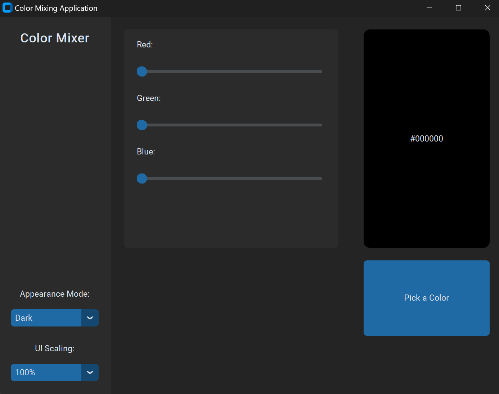

# Color Mixing Application

This is a simple color mixing application built using `CustomTkinter`. The application allows users to mix colors using sliders for red, green, and blue components, and displays the resulting color.

## Usage

### Windows

1. **Download and Extract** the application files.

2. **Open the Executable**:

   Locate and open the `color_mixer.exe` file to start the application.

   

3. **Mix Colors**:

   Use the sliders to adjust the Red, Green, and Blue values.

   

4. **View Mixed Color**:

   The resulting color will be displayed in the color display area.

   

### Linux

1. **Clone the Repository**:

   Open a terminal and run the following command to clone the repository:

   ```sh
   git clone https://github.com/yourusername/colormixer.git
   cd colormixer
